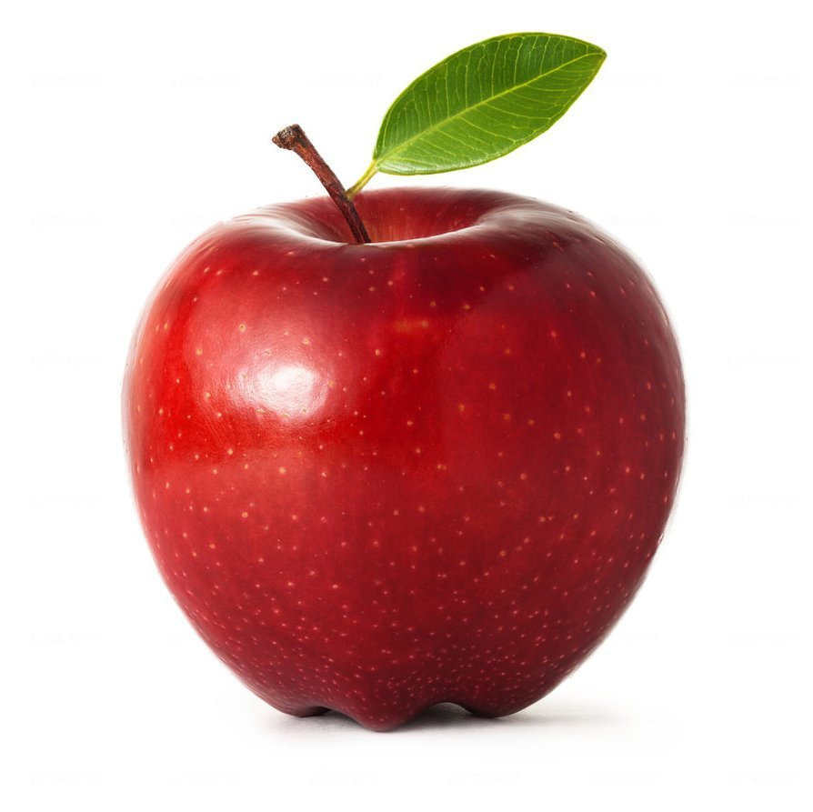

# Инструкция по языку MarkDown

## Уровни заголовков:

# Заголовок первого уровня
## Заголовок второго уровня ##
### Заголовок третьего уровня
#### Заголовок четвёртого уровня
##### Заголовок пятого уровня
###### Заголовок шестого уровня

## Стилизация текста:

Обычный текст набираем как есть

Новая строка

~~Зачёркнутый текст~~

<u>Подчёркнутый текст</u>

**Полужирный текст**

__Полужирный текст__

*Курсив*

_Курсив_

***Текст полужирным курсивом***

___Текст полужирным курсивом___

## Цитирование:

> Первый уровень цитирования
>> Второй уровень цитирования
>>> Третий уровень цитирования

## Списки:

### Ненумерованный список
* Лист
* Лист

### Нумерованный список
1. Лист
2. Лист

## WEB ссылки:

Текст [пример ссылки]("http.example.com" "Всплывающая подсказка")

## Добавление картинок:

Это яблоко
